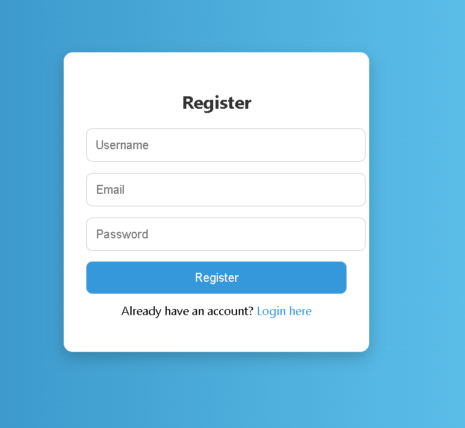

# 🌐 Elegant Auth System — Registration & Login with MongoDB + Email OTP (2FA)

A full-stack user authentication system with a stunning Bootstrap frontend and MongoDB backend. Now includes **email-based OTP verification (2FA)** during registration for enhanced security. Features a glassmorphism UI, form validation, password hashing, and dynamic background — perfect for modern web apps or portfolio projects.


---

## ✨ Features

- 🔐 **User Registration and Login**
- 🧊 **Glassmorphism UI Design with Bootstrap 5**
- 🔒 **Password Hashing with bcrypt**
- 📬 **Email-Based OTP Verification (2FA)**
- ⚡ **MongoDB Integration via Mongoose**
- 📜 **Form Validation and Error Feedback**
- 🌈 **Responsive & Beautiful Dynamic Backgrounds**

---

## 🛠️ Tech Stack

| Frontend               | Backend             | Database           |
| ---------------------- | ------------------- | ------------------ |
| HTML, CSS, Bootstrap 5 | Node.js, Express.js | MongoDB + Mongoose |

---

## 🚀 Getting Started

### 1️⃣ Clone the Repo

```bash
git clone https://github.com/Luimas007/login-register.git
cd login-register
```

### 2️⃣ Install Dependencies

```bash
npm install
```

### 3️⃣ Setup Environment Variables

Create a `.env` file in the root with the following:

```env
RESEND_API_KEY=your_resend_api_key_here
```

> 🔐 Use [Resend](https://resend.com/) for email-based OTP delivery. You can sign up and generate a free API key.

### 4️⃣ Start MongoDB

Make sure MongoDB is running locally (default port 27017). You can install MongoDB or use MongoDB Atlas.

```bash
mongod
```

### 5️⃣ Start the Server

```bash
node server.js
```

### 6️⃣ Open in Browser

Visit:  
`http://localhost:5000` → Login  
`http://localhost:5000/register.html` → Register  
`http://localhost:5000/otp.html` → Enter OTP (after registration)

---

## 🔑 How 2FA Works

- When a user registers, a **6-digit OTP** is generated and sent via email using Resend.
- The user is redirected to the OTP page (`otp.html`).
- The entered OTP is verified on the server.
- Only after successful OTP verification is the user account fully activated.

> ✨ This adds an extra layer of authentication without requiring third-party accounts like Gmail SMTP.

---

## 📁 Folder Structure

```
login-register/
├── public/
│   ├── login.html
│   ├── register.html
│   ├── otp.html
│   ├── styles.css
│   └── script.js
├── server.js
├── .env
└── package.json
```

---

## 📸 Screenshots

| Login                        | Register                           |
| ---------------------------- | ---------------------------------- |
|  |  |

---

## 📌 To-Do / Possible Enhancements

- ✅ Form field validation feedback
- ✅ Email OTP Verification (2FA)
- 🔐 JWT-based authentication
- 📫 Resend OTP + Countdown Timer
- 🗂️ Dashboard / profile page after login
- ☁️ Deploy to Render / Vercel / MongoDB Atlas

---

## 🧑‍💻 Author

Made with ❤️ by [Luimas007](https://github.com/Luimas007)

---

## 📄 License

MIT License — free to use, modify, and distribute.
